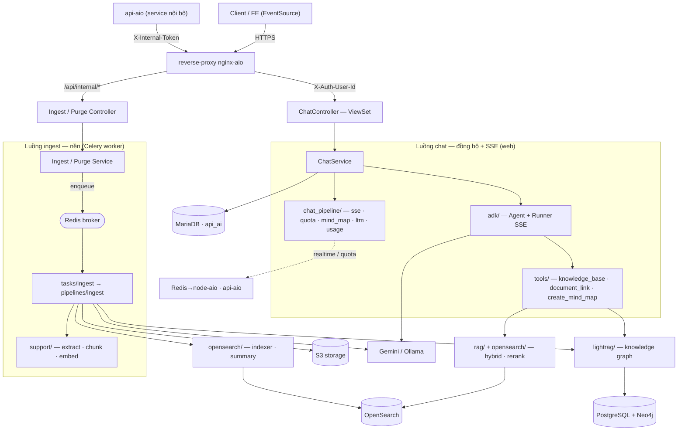
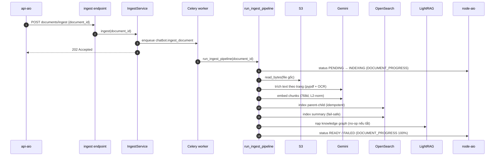
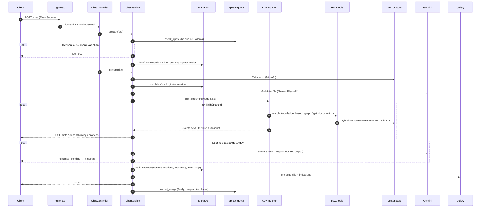

# Module `chatbot` — Chatbot RAG (tính năng chính)

Module `chatbot` là **tính năng cốt lõi** của ai-aio: một **chatbot RAG** có hai luồng nghiệp vụ chính.

1. **Ingest tài liệu** — nhận tài liệu (PDF/Word) từ kho `media` của api-aio, trích text theo trang, chunk + embed rồi index parent-child vào OpenSearch để dựng kho tri thức. Chạy nền qua Celery.
2. **Chat** — hỏi-đáp grounded trên kho tri thức, trả lời dạng **SSE streaming** qua **Google ADK** (Agent tự gọi tool RAG / knowledge graph), có trích nguồn (citations), suy luận (reasoning), sơ đồ tư duy (mind map), đính kèm file và trí nhớ dài hạn (LTM).

Module theo layout kiểu Laravel của repo (xem [../base/README.md](../base/README.md) cho lớp nền dùng chung): toàn bộ code nằm trong [app/](app/), route khai ở [routes/](routes/), migration ở [database/migrations/](database/migrations/), `AppConfig` ở [apps.py](apps.py). `apps.py` đặt `name = "modules.chatbot.app"` (để Django/Celery auto-discover `models` & `tasks` trong `app/`) và `label = "chatbot"` (giữ tên bảng/migration cũ).

Nối route vào hệ ở [../../config/urls.py](../../config/urls.py):

- `path("api/v1/chatbot/", include("modules.chatbot.routes.v1.public"))` — luồng chat công khai.
- `path("api/internal/v1/chatbot/", include("modules.chatbot.routes.v1.internal"))` — ingest/purge nội bộ.

---

## Sơ đồ kiến trúc & luồng code

Toàn cảnh: request đi vào qua `nginx-aio`, tách 2 luồng — **chat** (đồng bộ + SSE, chạy trong web/Gunicorn) và **ingest** (nền, chạy trong Celery worker). Hai luồng dùng chung tầng truy hồi (`opensearch/`, `lightrag/`), LLM (Gemini/Ollama) và MariaDB.



> **Online** (web): [http/](app/http/) → [services/v1/](app/services/v1/) → [adk/](app/adk/) + [chat_pipeline/](app/chat_pipeline/) + [tools/](app/tools/). **Offline** (worker): [tasks/](app/tasks/) → [pipelines/ingest.py](app/pipelines/ingest.py) → [support/](app/support/) → [opensearch/](app/opensearch/) + [lightrag/](app/lightrag/). Chi tiết từng bước ở [§5](#5-luồng-chính).

---

## 1. Cây thư mục `app/`

```
app/
├── adk/                     # Tầng Google ADK (Agent + Runner streaming SSE)
│   ├── agent.py             #   create_root_agent(): Agent gốc + instruction + nạp tool (cache)
│   ├── runner.py            #   get_runner()/get_session_service(): Runner + InMemorySessionService (cache)
│   ├── session.py           #   create_session_with_history(): tạo session + inject lịch sử từ DB
│   ├── stream_handler.py    #   ADKStreamHandler: Event ADK → StreamChunk (text/thinking/citations/mindmap)
│   ├── tools.py             #   4 tool ADK: search_knowledge_base / search_knowledge_graph / get_document_url / create_mind_map
│   └── constants.py         #   APP_NAME, ROOT_AGENT_NAME, tên các tool
├── tools/                   # Thân các tool RAG (thuần, không ADK)
│   ├── knowledge_base.py    #   search(): embed → hybrid BM25+kNN (RRF) → rerank → lọc ngưỡng → top_k
│   └── document_link.py     #   get_url(): media_id → link công khai (qua MediaRepository)
├── chat_pipeline/           # Tầng sinh câu trả lời (generation) + trí nhớ + hạn mức
│   ├── config.py            #   ChatConfig.from_env(): mọi tham số chat/LTM/attach/mindmap/provider
│   ├── history.py           #   load_history_contents(): sliding window N tin nhắn → types.Content
│   ├── prompt.py            #   build_user_message(): ghép (file đính kèm) + LTM + câu hỏi
│   ├── sse.py               #   Contract SSE: meta/delta/thinking/citations/mindmap_pending/mindmap/done/error
│   ├── citations.py         #   Citation (anti-corruption layer) + normalize_citations()
│   ├── mind_map.py          #   generate_mind_map() (Gemini structured output) + normalize_mind_map()
│   ├── token_quota.py       #   check_quota()/record_usage() sang api-aio; QuotaUnavailable
│   ├── usage.py             #   TokenUsage: cộng dồn token qua các lần gọi LLM
│   └── generator.py         #   generate_text(): Gemini non-stream (chỉ dùng sinh tiêu đề)
├── rag/                     # Cấu hình + hạ tầng truy hồi/embed
│   ├── config.py            #   RerankConfig, RetrieveConfig (top_k=5/top_n=30/rrf_k=60) + helper _env*
│   ├── embedder.py          #   embed_chunks()/embed_query(): Gemini embedding + L2-normalize
│   ├── embedding_provider.py#   get_embedding_client(): chọn Gemini | Ollama theo EMBEDDING_PROVIDER
│   ├── reranker_client.py   #   rerank(): POST endpoint cross-encoder (fail-safe), gắn rerank_score
│   └── exceptions.py        #   RagPipelineError, UnsupportedDocumentError
├── opensearch/              # Lớp truy cập OpenSearch
│   ├── indexer.py           #   OpenSearchIndexer: mapping join, ghi parent-child, delete/purge
│   ├── retriever.py         #   Retriever: BM25 + kNN + RRF + mget metadata parent
│   ├── summary_indexer.py   #   SummaryIndexer: tóm tắt tài liệu (≤200 ký tự) + index vector riêng
│   └── ltm.py               #   ChatHistoryIndex: long-term memory (index + kNN theo user_id)
├── pipelines/
│   └── ingest.py            #   run_ingest_pipeline(): thân pipeline ingest (extract→chunk→embed→index→summary→KG)
├── support/                 # Helper hạ tầng ingest + đính kèm file
│   ├── extract_helper.py    #   extract_pages()/pages_to_text(): điều phối trích text theo trang
│   ├── pdf_extract_helper.py#   extract_pdf_pages(): pypdf + Gemini OCR (trang scan/lai)
│   ├── word_to_pdf_helper.py#   word_to_pdf(): LibreOffice headless (.doc/.docx → PDF)
│   ├── page_chunker.py      #   chunk_pages(): RecursiveCharacterTextSplitter + contextual header
│   ├── chunk_config.py      #   ChunkConfig.from_env(): CHUNK_SIZE / CHUNK_OVERLAP
│   ├── contextual_header_config.py # ContextualHeaderConfig.from_env(): header light gắn vào chunk
│   └── chat_attachments.py  #   ChatAttachments: đẩy media lên Gemini Files API (native multimodal)
├── tasks/                   # Vỏ Celery (mỏng, autodiscover)
│   ├── ingest.py            #   chatbot.ingest_document
│   ├── chat.py              #   chatbot.generate_conversation_title / chatbot.index_chat_turn
│   └── purge.py             #   chatbot.purge_document
├── models/                  # Model Django
│   ├── chat_conversation.py #   ChatConversation (chatbot_conversations, managed)
│   ├── chat_message.py      #   ChatMessage (chatbot_messages) — có citations/reasoning/mind_map
│   ├── chat_message_file.py #   ChatMessageFile (chatbot_message_files) — cache URI Gemini
│   └── chatbot_document.py  #   ChatbotDocument (chatbot_documents, managed=False — của api-aio)
├── enums/                   # TextChoices
│   ├── conversation_status.py  # OPEN / CLOSED
│   ├── document_status.py      # PENDING / INDEXING / READY / FAILED
│   ├── message_role.py         # user / assistant
│   ├── message_status.py       # PROCESSING / SUCCESS / ERROR
│   └── realtime_event.py       # chatbot.document.progress / chatbot.conversation.title
├── http/
│   ├── controllers/v1/      # ChatController (ViewSet) + Ingest/Purge DocumentController (APIView)
│   └── requests/v1/         # ChatRequest/DTO, Ingest/Purge/UpdateConversation request + DTO
├── services/v1/             # ChatService, IngestDocumentService, PurgeDocumentService
├── contracts/               # Interface (ABC) cho repository & service
├── repositories/            # ChatConversation/ChatMessage/ChatMessageFile/ChatbotDocument repository
├── transformers/            # Conversation/Message/Document transformer (shape JSON cho FE)
├── catalogs/                # ChatbotCatalog (key i18n cho translate())
├── lightrag/
│   └── lightrag_client.py   #   LightRagIndexer / LightRagQuerier (knowledge graph)
└── management/commands/
    └── eval_rag.py          #   command `python manage.py eval_rag` (đánh giá RAG)
```

---

## 2. Giải thích theo lớp / package

### `adk/` — Google ADK (luồng chat streaming)

- **[app/adk/agent.py](app/adk/agent.py)** — `create_root_agent()` dựng `Agent` gốc (cache qua `functools.lru_cache`), nạp instruction hệ thống (RAG grounded, có trích nguồn, luôn trả theo ngôn ngữ câu hỏi, danh tính "Overfitting Club") và bốn tool: `search_knowledge_base`, `get_document_url`, `search_knowledge_graph`, và `create_mind_map` (chỉ thêm khi `CHAT_MINDMAP_ENABLED`). Bật suy luận (`BuiltInPlanner` + `include_thoughts=True`) — riêng provider `ollama` thì tắt planner. Model dựng theo provider: `gemini` dùng string model (`GEMINI_CHAT_MODEL`); `ollama` dùng `LiteLlm("ollama_chat/<model>")`.
- **[app/adk/runner.py](app/adk/runner.py)** — cache một `Runner` + một `InMemorySessionService` dùng chung. Session giữ trong RAM còn nguồn sự thật là DB (`chatbot_messages`) nên hoạt động đúng cả khi Gunicorn có nhiều worker. Map `GEMINI_API_KEY → GOOGLE_API_KEY` (ADK đọc `GOOGLE_API_KEY`).
- **[app/adk/session.py](app/adk/session.py)** — `create_session_with_history()`: tạo session mới rồi append từng `types.Content` lịch sử thành `Event` (bọc coroutine async qua `async_to_sync` đúng một lần).
- **[app/adk/stream_handler.py](app/adk/stream_handler.py)** — `ADKStreamHandler.process(event)` bóc mỗi `Event` ADK thành `StreamChunk` với `kind` ∈ {`text`, `thinking`, `citations`, `mindmap`}. Dedup event cuối (không partial) đã gộp toàn bộ text nhưng vẫn xử lý `function_response` (tool có thể gọi sau khi đã stream text). `function_response` của `search_knowledge_base` → citations; của `create_mind_map` → tín hiệu mindmap.
- **[app/adk/constants.py](app/adk/constants.py)** — `APP_NAME="ai_aio_chatbot"`, `ROOT_AGENT_NAME="aio_chatbot"`, tên các tool.

### `tools/` — thân tool truy hồi

- **[app/tools/knowledge_base.py](app/tools/knowledge_base.py)** — `search(query, top_k, top_n)`: (1) embed query (`RETRIEVAL_QUERY`, 768 chiều, L2-normalize); vector `None` → chỉ BM25. (2) hybrid BM25 + kNN, hợp nhất bằng RRF → top_n ứng viên. (3) rerank cross-encoder qua HTTP; tắt/lỗi → giữ thứ hạng hybrid. (4) **lọc chống bịa**: rerank chạy → lọc theo `RERANK_SCORE_THRESHOLD`; rerank không chạy nhưng có `HYBRID_MIN_COSINE` → fallback lọc theo điểm cosine kNN. (5) cắt `top_k`, trả list `{chunk_text, score, document_id, media_id, original_name, page}`. Câu hỏi ngoài phạm vi → mọi chunk dưới ngưỡng bị loại → trả `[]` → agent từ chối thay vì ghép từ nhiễu.
- **[app/tools/document_link.py](app/tools/document_link.py)** — `get_url(media_id)`: `media_id` → `{media_id, original_name, url}` (dựng URL S3 qua `MediaRepository`), `None` nếu không tìm thấy. Fail-soft.

Tool sơ đồ tư duy `create_mind_map` được khai ở [app/adk/tools.py](app/adk/tools.py): nó chỉ là **TRIGGER thuần** — trả `{"requested": true, "content", "focus"}` (không gọi Gemini trong tool để không chặn event-loop); JSON sơ đồ sinh sau ở `chat_service` qua `chat_pipeline/mind_map.py`.

### `chat_pipeline/` — sinh câu trả lời, trí nhớ, hạn mức

- **[app/chat_pipeline/config.py](app/chat_pipeline/config.py)** — `ChatConfig.from_env()`: gom mọi tham số chat (model, `CHAT_MAX_OUTPUT_TOKENS`, `context_top_k`, `history_size`), tiêu đề, LTM, provider (gemini/ollama), file đính kèm và mind map.
- **[app/chat_pipeline/history.py](app/chat_pipeline/history.py)** — `load_history_contents()`: lấy N tin nhắn SUCCESS gần nhất (bỏ 2 message của lượt hiện tại), map sang `types.Content` role `user`/`model`; message cũ có file đính kèm được gắn lại Part (Gemini Files API).
- **[app/chat_pipeline/prompt.py](app/chat_pipeline/prompt.py)** — `build_user_message()`: ghép block "file đính kèm" + block LTM + câu hỏi + reminder ngôn ngữ (ngữ cảnh tài liệu do tool cung cấp, không nhồi vào prompt).
- **[app/chat_pipeline/sse.py](app/chat_pipeline/sse.py)** — **contract SSE duy nhất**: builder các event và `emit_chat_events()` điều phối thứ tự `meta → (delta | thinking | citations)* → mindmap? → done | error`. Wire format: mỗi event một dòng `data: <json>\n\n`. `meta` phát "lazy" ngay trước mẩu output đầu (kèm citations nếu tool đã chạy). Trả `EmitResult` (citations + cờ/nội dung yêu cầu mind map).
- **[app/chat_pipeline/citations.py](app/chat_pipeline/citations.py)** — dataclass `Citation` (anti-corruption layer): whitelist field `{chunk_text, score, document_id, media_id, original_name, page}`, ép kiểu, `normalize_citations()` fail-soft.
- **[app/chat_pipeline/mind_map.py](app/chat_pipeline/mind_map.py)** — `generate_mind_map(source, focus, model)`: gọi Gemini structured-output (`MINDMAP_RESPONSE_SCHEMA`) sinh cây **node phẳng** (`parent_id`, tránh đệ quy/`$ref`); `normalize_mind_map()` chuẩn hoá (bỏ node trùng/thiếu, cắt vòng lặp cha-con, cân bằng `direction` left/right nhánh cấp 1, giới hạn 200 node).
- **[app/chat_pipeline/token_quota.py](app/chat_pipeline/token_quota.py)** — `check_quota(user_id)` (POST `/api/internal/v1/chatbot/tokens/check` sang api-aio) và `record_usage(user_id, tokens)` (POST `.../tokens/record`). `check_quota` **fail-CLOSED** — không xác nhận được → raise `QuotaUnavailable`. `record_usage` fail-safe.
- **[app/chat_pipeline/usage.py](app/chat_pipeline/usage.py)** — `TokenUsage`: cộng dồn `usage_metadata` của event FINAL từng lần gọi LLM (prompt/thinking/output/total + `llm_calls`).
- **[app/chat_pipeline/generator.py](app/chat_pipeline/generator.py)** — `generate_text()`: Gemini non-stream, giờ chỉ còn dùng cho sinh tiêu đề hội thoại.

### `rag/` — cấu hình & hạ tầng truy hồi

- **[app/rag/config.py](app/rag/config.py)** — `RerankConfig` (endpoint/model/timeout/`score_threshold`) + `RetrieveConfig` (**`top_k=5`, `top_n=30`, `rrf_k=60` fix cứng trong code**; chỉ `min_cosine` đọc env `HYBRID_MIN_COSINE`). Chứa các helper `_env`, `_env_bool`, `_env_int`, `_env_float` dùng chung cho các config khác.
- **[app/rag/embedder.py](app/rag/embedder.py)** — `embed_chunks()` (`RETRIEVAL_DOCUMENT`, batch 50) và `embed_query()` (`RETRIEVAL_QUERY`), tự **L2-normalize** (gemini-embedding-001 ở <3072 chiều không chuẩn hoá sẵn); bỏ vector sai số chiều.
- **[app/rag/embedding_provider.py](app/rag/embedding_provider.py)** — `get_embedding_client()`: `EMBEDDING_PROVIDER` = `gemini` (mặc định) | `ollama`.
- **[app/rag/reranker_client.py](app/rag/reranker_client.py)** — `rerank()`: POST `{model, query, documents}` tới endpoint ngoài, nhận điểm (hỗ trợ schema TEI/BGE và Cohere/Jina), gắn `rerank_score` và xếp lại; mọi lỗi → giữ nguyên thứ hạng hybrid.
- **[app/rag/exceptions.py](app/rag/exceptions.py)** — `RagPipelineError`, `UnsupportedDocumentError` (tách lỗi "bỏ qua có chủ đích" khỏi lỗi hệ thống).

### `opensearch/` — vector store

- **[app/opensearch/indexer.py](app/opensearch/indexer.py)** — `OpenSearchIndexer`: mapping parent-child qua join field `doc_join` (parent = metadata, child = `chunk_text` + `chunk_vector` HNSW/lucene/cosinesimil). `index_document()` idempotent: ghi version mới (`{document_id}:{uuid}`) trước, đợi search thấy được rồi mới xoá bản cũ (re-ingest không có khoảng trống); bulk theo batch 100 + phát tiến độ theo % trang. `delete_document()` (purge toàn bộ) và `_delete_stale()` (giữ version mới) — luôn xoá CHILD trước PARENT.
- **[app/opensearch/retriever.py](app/opensearch/retriever.py)** — `Retriever.retrieve()`: hai lượt search trên CHILD (BM25 `chunk_text`, kNN `chunk_vector`), hợp nhất RRF, `mget` metadata parent, trả kèm `page`, `score` (RRF) và `knn_score` (cosine — làm sàn chống bịa dự phòng).
- **[app/opensearch/summary_indexer.py](app/opensearch/summary_indexer.py)** — `SummaryIndexer`: Gemini Flash tóm tắt tài liệu (≤200 ký tự) + embed → index riêng (`OPENSEARCH_SUMMARY_INDEX`), idempotent theo `document_id`. Fail-safe.
- **[app/opensearch/ltm.py](app/opensearch/ltm.py)** — `ChatHistoryIndex` (long-term memory): `index_turn()` lưu mỗi lượt hỏi-đáp thành 1 doc (vector từ CÂU HỎI); `search(user_id, query)` kNN trong phạm vi `user_id`, lọc theo `CHAT_LTM_MIN_SCORE`, trả text các lượt liên quan. Toàn bộ fail-safe.

### `pipelines/` — thân ingest

- **[app/pipelines/ingest.py](app/pipelines/ingest.py)** — `run_ingest_pipeline(document_id)`: điều phối toàn bộ ingest (chi tiết ở [§5](#5-luồng-chính)). Bắt lỗi HẸP theo kiểu dịch vụ ngoài (`botocore`/Gemini/OpenSearch + `UnsupportedDocumentError`) → `FAILED`; lỗi code nội bộ propagate lên vỏ task (lưới an toàn cuối). Phát tiến độ realtime qua `_emit_progress` → `_push_progress` (broadcast `DOCUMENT_PROGRESS`).

### `support/` — helper hạ tầng ingest & đính kèm

- **[app/support/extract_helper.py](app/support/extract_helper.py)** — `extract_pages()` (chọn luồng theo `kind`: PDF hoặc Word→PDF), `pages_to_text()` (full-text cho summary/KG).
- **[app/support/pdf_extract_helper.py](app/support/pdf_extract_helper.py)** — `extract_pdf_pages()`: duyệt từng trang pypdf; trang scan (ít text, ngưỡng `MIN_PAGE_TEXT_CHARS`) hoặc trang lai có ảnh đáng kể (ngưỡng `MIN_OCR_IMAGE_BYTES`) → tách thành PDF một trang rồi OCR qua Gemini.
- **[app/support/word_to_pdf_helper.py](app/support/word_to_pdf_helper.py)** — `word_to_pdf()`: LibreOffice headless (`LIBREOFFICE_BIN`, `LIBREOFFICE_TIMEOUT`), mỗi lần convert dùng `-env:UserInstallation` profile riêng (chạy song song an toàn).
- **[app/support/page_chunker.py](app/support/page_chunker.py)** — `chunk_pages()`: `RecursiveCharacterTextSplitter`, mỗi chunk thuộc đúng 1 trang, prefix bằng contextual header (đi vào chính `text` nên ảnh hưởng cả vector lẫn `chunk_text` được lưu).
- **[app/support/chunk_config.py](app/support/chunk_config.py)** / **[app/support/contextual_header_config.py](app/support/contextual_header_config.py)** — config chunk (`CHUNK_SIZE`/`CHUNK_OVERLAP`) và header (`CONTEXTUAL_HEADER_ENABLED`/`CONTEXTUAL_HEADER_FORMAT`).
- **[app/support/chat_attachments.py](app/support/chat_attachments.py)** — `ChatAttachments`: đẩy `media_ids` lên **Gemini Files API** (tải S3 → Word→PDF nếu cần → upload → cache URI vào `chatbot_message_files`), dựng `types.Part` cho lượt hiện tại (`attach_to_turn`) và cho lịch sử (`history_parts`, re-push nếu quá TTL). Fail-safe theo từng file.

### `tasks/` — vỏ Celery

| Task (`name=`) | File | Việc làm |
|---|---|---|
| `chatbot.ingest_document` | [app/tasks/ingest.py](app/tasks/ingest.py) | Gọi `run_ingest_pipeline(document_id)`; lưới an toàn cuối: log traceback + `FAILED` (không retry). |
| `chatbot.generate_conversation_title` | [app/tasks/chat.py](app/tasks/chat.py) | Sinh tiêu đề ngắn (Gemini Flash) khi `title` còn `None` (idempotent); lượt thắng đẩy realtime `CONVERSATION_TITLE` cho chủ hội thoại. |
| `chatbot.index_chat_turn` | [app/tasks/chat.py](app/tasks/chat.py) | Lưu lượt hỏi-đáp vào LTM (`ChatHistoryIndex.index_turn`). Fail-safe. |
| `chatbot.purge_document` | [app/tasks/purge.py](app/tasks/purge.py) | Dọn 3 nơi độc lập: rag-index (`OpenSearchIndexer.delete_document`), summary index, LightRAG KG. Best-effort. |

### `models/` (chi tiết ở [§6](#6-mô-hình-dữ-liệu))

### `enums/`

| Enum | Giá trị | Cột |
|---|---|---|
| `ConversationStatus` | `OPEN`, `CLOSED` | `chatbot_conversations.status` |
| `DocumentStatus` | `PENDING`, `INDEXING`, `READY`, `FAILED` | `chatbot_documents.status` |
| `MessageRole` | `user`, `assistant` | `chatbot_messages.role` |
| `MessageStatus` | `PROCESSING`, `SUCCESS`, `ERROR` | `chatbot_messages.status` |
| `RealtimeEvent` | `chatbot.document.progress`, `chatbot.conversation.title` | `type` của envelope realtime |

### `http/` — controller & request

- **[app/http/controllers/v1/chat_controller.py](app/http/controllers/v1/chat_controller.py)** — `ChatController` (ViewSet) gộp 5 action: `chat` (SSE), `conversations` (list), `messages` (list), `rename` (PATCH), `destroy` (DELETE). `user_id` lấy từ `CurrentUser()` (gate `ensure_authenticated` đã populate). Dùng `_IgnoreClientNegotiation` để không 406 khi EventSource gửi `Accept: text/event-stream`; SSE trả qua `StreamingHttpResponse` với `X-Accel-Buffering: no`.
- **[app/http/controllers/v1/ingest_document_controller.py](app/http/controllers/v1/ingest_document_controller.py)** / **[.../purge_document_controller.py](app/http/controllers/v1/purge_document_controller.py)** — `APIView` nội bộ, validate rồi gọi service.
- **[app/http/requests/v1/chat_request.py](app/http/requests/v1/chat_request.py)** — `ChatRequest` validate `{question, conversation_id?, media_ids?}`; `ChatDTO` (bất biến, `user_id` từ header). `media_ids` chỉ validate shape (list số nguyên dương), sự tồn tại/loại file xử lý fail-safe ở tầng đính kèm.
- **[.../ingest_document_request.py](app/http/requests/v1/ingest_document_request.py)** — validate `document_id` + kiểm tra bản ghi tồn tại (`ChatbotDocumentRepository.exists`).
- **[.../purge_document_request.py](app/http/requests/v1/purge_document_request.py)** — validate `document_id`, KHÔNG check tồn tại (api-aio đã soft-delete trước khi báo purge).
- **[.../update_conversation_request.py](app/http/requests/v1/update_conversation_request.py)** — validate `title` (≤255 ký tự).

### `services/v1/`

- **[app/services/v1/chat_service.py](app/services/v1/chat_service.py)** — `ChatService`: `prepare()` (check hạn mức → tạo/lấy conversation có khoá hàng → chặn lượt trùng → lưu message user + placeholder), `stream()` (generator SSE), `list_conversations`/`list_messages`/`rename_conversation`/`delete_conversation`.
- **[app/services/v1/ingest_service.py](app/services/v1/ingest_service.py)** / **[.../purge_service.py](app/services/v1/purge_service.py)** — enqueue task Celery và trả `202 Accepted` ngay.

### `contracts/` — hợp đồng (ABC)

Interface tách "cái gì" khỏi "làm thế nào": [contracts/repositories/](app/contracts/repositories/) (chat conversation/message/document) và [contracts/services/v1/](app/contracts/services/v1/) (ingest/purge). Implementation ở `repositories/` và `services/v1/` kế thừa các interface này.

### `repositories/`

`ChatConversationRepository` (`find_owned`/`find_owned_locked` với `select_for_update`, `paginate_for_user` với anchor `max_id` + lọc `q` qua `Exists` subquery, `set_title_if_empty`), `ChatMessageRepository` (`has_processing`, `add_user_message`, `add_assistant_placeholder`, `mark_success`/`mark_error`, `recent_success`, `paginate_for_conversation`), `ChatMessageFileRepository` (cache URI Gemini), `ChatbotDocumentRepository` (`exists`, `find_with_media`, `update_progress` — clamp percent 0–100). Đều kế thừa `BaseRepository` của [../base/README.md](../base/README.md).

### `transformers/`, `catalogs/`

`ConversationTransformer`/`MessageTransformer`/`DocumentTransformer` shape JSON cho FE (message kèm `reasoning`, `citations`, `mind_map`). `ChatbotCatalog` (namespace `CHATBOT`) giữ key i18n cho `translate()`.

### `lightrag/`

- **[app/lightrag/lightrag_client.py](app/lightrag/lightrag_client.py)** — `LightRagIndexer` (nạp text tài liệu vào KG lúc ingest, re-index sạch theo `chatbot_{document_id}`) và `LightRagQuerier` (`only_need_context=True`, mode `mix`, trả context thô cho tool `search_knowledge_graph`). Hạ tầng (env `LIGHTRAG_*`, PG/Neo4j) do `BaseLightRagClient` ở base quản. Tắt mặc định thì no-op; mọi lỗi bị nuốt (không đổi status). `LightRagQuerier` dùng `_run_coro_blocking` để chạy được cả khi ADK runner sync đang giữ event loop (chạy trong thread riêng).

### `management/commands/`

- **[app/management/commands/eval_rag.py](app/management/commands/eval_rag.py)** — command `python manage.py eval_rag` đánh giá 3 tầng (truy hồi / sinh / hệ thống) trên bộ golden QA. Chi tiết dataset/kết quả xem [eval/README.md](eval/README.md).

---

## 3. Endpoints

Prefix `/api/v1/chatbot/` (công khai) khai ở [routes/v1/public.py](routes/v1/public.py); prefix `/api/internal/v1/chatbot/` (nội bộ) ở [routes/v1/internal.py](routes/v1/internal.py).

| Method | URL | Action | Mô tả |
|---|---|---|---|
| POST | `/api/v1/chatbot/chat` | `chat` | Hỏi-đáp RAG — trả **SSE**. Body `{question, conversation_id?, media_ids?}`. |
| GET | `/api/v1/chatbot/conversations` | `conversations` | List hội thoại của user (phân trang; query `?q`, `?max_id`). |
| PATCH | `/api/v1/chatbot/conversations/{id}` | `rename` | Đổi tên hội thoại. Body `{title}`. |
| DELETE | `/api/v1/chatbot/conversations/{id}` | `destroy` | Xoá mềm hội thoại. |
| GET | `/api/v1/chatbot/conversations/{id}/messages` | `messages` | List tin nhắn của 1 hội thoại (phân trang). |
| POST | `/api/internal/v1/chatbot/documents/ingest` | — | **Nội bộ** — `{document_id}` → enqueue ingest → `202`. |
| POST | `/api/internal/v1/chatbot/documents/purge` | — | **Nội bộ** — `{document_id}` → enqueue purge → `202`. |

**Xác thực:**

- Nhóm `/api/v1/chatbot/*` (công khai): nginx verify token user (qua api-aio) rồi forward header `X-Auth-User-Id`. Gate route `ensure_authenticated` chặn `401` nếu thiếu, có thì populate `CurrentUser` (không global — áp per-route như route-middleware Laravel). Không đi qua `VerifyInternalToken`.
- Nhóm `/api/internal/v1/*` (service-to-service): middleware toàn cục `VerifyInternalToken` chốt header `X-Internal-Token` ở prefix (sai → `403`). Không gắn user.

**Mã lỗi nghiệp vụ (luồng chat, do `prepare()` raise TRƯỚC khi phát header SSE):**

- `409` — hội thoại còn lượt đang xử lý (`has_processing`).
- `404` — hội thoại không tồn tại / không thuộc user.
- `429` — hết hạn mức token (`check_quota` trả `allowed=false`).
- `503` — không xác nhận được hạn mức (`QuotaUnavailable`, fail-closed).

Lỗi xảy ra SAU khi đã phát header (trong `stream`) không raise mà đi qua event SSE `error` + đánh dấu message `ERROR`.

---

## 4. Contract SSE của luồng chat

Wire format: mỗi event một dòng `data: <json>\n\n` (không dùng field `event:`/`id:`). Thứ tự:

```
meta → (delta | thinking | citations)* → mindmap_pending? → mindmap? → done | error
```

| Event | Payload | Ý nghĩa |
|---|---|---|
| `meta` | `{type, conversation_id, message_id, citations}` | Đầu tiên, 1 lần (phát "lazy" ngay trước mẩu output đầu). Citations lần đầu gộp vào đây. |
| `delta` | `{type, content}` | Một mẩu câu trả lời (FE append dần). |
| `thinking` | `{type, content}` | Một mẩu suy luận (khi model bật thoughts). |
| `citations` | `{type, citations}` | Nguồn bổ sung khi tool RAG gọi từ lần 2 trở đi. |
| `mindmap_pending` | `{type}` | Báo FE sơ đồ tư duy đang được tạo (hiện loading). |
| `mindmap` | `{type, mind_map}` | Sơ đồ tư duy trọn gói `{title, nodes:[...]}` — phát sau mẩu trả lời cuối, trước `done`. |
| `done` | `{type, status:"success", message_id, total_tokens}` | Kết thúc OK. |
| `error` | `{type, status:"error", message, message_id}` | Kết thúc lỗi (HTTP đã 200 nên lỗi đi qua event). |

---

## 5. Luồng chính

### 5.1. Ingest tài liệu



Kích hoạt: api-aio gọi `POST /api/internal/v1/chatbot/documents/ingest {document_id}` → `IngestDocumentService.ingest()` enqueue task Celery `chatbot.ingest_document` → `run_ingest_pipeline(document_id)` chạy trong worker:

1. Đọc bản ghi `chatbot_documents` (kèm `media` qua `select_related`); thiếu media hoặc loại file không hỗ trợ → `FAILED`. Đánh `PENDING` → `INDEXING` (reset `indexed_percent=0`).
2. Tải file gốc từ **S3** (`S3Client.read_bytes(media.file_name)`).
3. **Trích text theo trang** (`extract_pages`): PDF duyệt từng trang bằng pypdf, trang scan/lai → OCR cả trang qua Gemini; Word → convert PDF (LibreOffice) rồi đi luồng PDF. Phát tiến độ theo số trang OCR (0..80%). Text rỗng → `FAILED`.
4. **Chunk theo trang** (`chunk_pages`) — mỗi chunk mang số trang + contextual header — rồi **embed** (`embed_chunks`, Gemini, L2-normalize). Không có chunk hợp lệ → `FAILED`.
5. **Index parent-child vào OpenSearch** (`OpenSearchIndexer.index_document`, idempotent, phát tiến độ 80..100% theo % trang đã index).
6. **Phụ (fail-safe, KHÔNG chặn READY)**: index summary (`SummaryIndexer`) + nạp LightRAG/KG (`LightRagIndexer`, no-op nếu tắt).
7. Đánh `READY` (hoặc `FAILED` nếu lỗi dịch vụ ngoài ở bước 2–5). Mỗi lần status/percent đổi → phát realtime `chatbot.document.progress`.

`chatbot_documents.status`: `PENDING → INDEXING → READY | FAILED`.

### 5.2. Chat



`POST /api/v1/chatbot/chat` → `ChatController.chat` → `ChatService`:

**`prepare()` (đồng bộ, có thể raise lỗi nghiệp vụ):**

1. **Kiểm hạn mức token** (bỏ qua nếu `LLM_PROVIDER=ollama` — LLM local miễn phí): `check_quota` sang api-aio → `QuotaUnavailable` = `503` (fail-closed), `allowed=false` = `429`. Chạy NGOÀI transaction để không giữ DB lock khi gọi HTTP.
2. Trong 1 transaction: lấy/tạo conversation (có sẵn thì khoá hàng `SELECT ... FOR UPDATE`) → chặn `409` nếu còn lượt đang xử lý → lưu message `user` (SUCCESS) + placeholder `assistant` (PROCESSING).

**`stream()` (generator SSE, KHÔNG raise sau khi phát header):**

1. **LTM** — nếu bật, `ChatHistoryIndex.search(user_id, question)` lấy ngữ cảnh hội thoại cũ liên quan (fail-safe).
2. **Nạp lịch sử** N lượt gần nhất (`load_history_contents`) vào **session ADK** (`create_session_with_history`).
3. **Đính kèm file** lượt này (`media_ids` → Gemini Files API, fail-safe).
4. Dựng prompt (`build_user_message`) + Content (text + Part file) → chạy **ADK Runner** (`StreamingMode.SSE`). Agent tự quyết gọi tool: `search_knowledge_base` (hybrid + rerank), `search_knowledge_graph` (KG), `get_document_url` (link), `create_mind_map` (trigger sơ đồ).
5. `emit_chat_events` điều phối thứ tự SSE, gom answer/reasoning/citations. Cộng dồn token qua `TokenUsage`.
6. Nếu user yêu cầu sơ đồ và `CHAT_MINDMAP_ENABLED` → phát `mindmap_pending`, `generate_mind_map` (Gemini structured output, token cộng vào lượt), phát `mindmap`.
7. `mark_success` lưu message (content + citations + reasoning + mind_map) → enqueue nền `chatbot.generate_conversation_title` (nếu chưa có title) + `chatbot.index_chat_turn` (LTM) → phát `done`.
8. `finally`: log token; `record_usage` về api-aio (bỏ qua nếu ollama); xoá session ADK.

---

## 6. Mô hình dữ liệu

| Model | Bảng | `managed` | Ghi chú |
|---|---|---|---|
| `ChatConversation` | `chatbot_conversations` | `True` | Của ai-aio. `user_id` (BigInteger, không FK sang `users` của api-aio), `title` (null tới khi sinh nền), `status`. Soft-delete. |
| `ChatMessage` | `chatbot_messages` | `True` | FK `conversation`. `role`, `content`, `reasoning` (TextField), `citations` (JSON), `mind_map` (JSON), `status`. Soft-delete, `ordering=["id"]`. |
| `ChatMessageFile` | `chatbot_message_files` | `True` | FK `conversation`+`message`, `media_id` (không FK), `gemini_uri`, `pushed_at` (cache TTL Gemini Files API). |
| `ChatbotDocument` | `chatbot_documents` | **`False`** | **Do api-aio sở hữu** — Django chỉ ĐỌC + ghi DATA cột `status`/`indexed_percent` (KHÔNG migrate cấu trúc). FK `media` (`DO_NOTHING`). |

`ChatConversation`/`ChatMessage`/`ChatMessageFile` kế thừa `SoftDeleteModel` của [../base/README.md](../base/README.md). `MIGRATION_MODULES["chatbot"]` trỏ migration về [database/migrations/](database/migrations/) (xem [../../config/settings.py](../../config/settings.py)).

**Tiến hoá schema** ([database/migrations/](database/migrations/)):

| Migration | Nội dung |
|---|---|
| `0001_initial` | `ChatbotDocument` (managed=False; state cho Django biết cấu trúc bảng của api-aio). |
| `0002_chat_conversation` | Tạo `chatbot_conversations`. |
| `0003_chat_message` | Tạo `chatbot_messages` (FK conversation, citations). |
| `0004_chat_message_file` | Tạo `chatbot_message_files` (đính kèm file, cache URI Gemini). |
| `0005_chat_message_reasoning` | Thêm cột `reasoning` (thinking/thoughts). |
| `0006_chat_message_mind_map` | Thêm cột `mind_map` (sơ đồ tư duy). |

---

## 7. Biến môi trường

Khai ở [../../.env.example](../../.env.example) (secret ở `docker/secrets.env`). Bảng dưới gom các biến module `chatbot` đọc thực tế trong code (mặc định lấy từ `from_env`).

| Nhóm | Biến | Mặc định | Ghi chú |
|---|---|---|---|
| Gemini | `GEMINI_API_KEY` | — (secret) | Map sang `GOOGLE_API_KEY` cho ADK. |
| | `EMBEDDING_MODEL` | `gemini-embedding-001` | Model embedding. |
| | `GEMINI_EXTRACT_MODEL` | `gemini-2.5-flash` | OCR / trích text. |
| | `GEMINI_CHAT_MODEL` | `gemini-2.5-flash` | Model chat (agent ADK). |
| | `GEMINI_SUMMARY_MODEL` | `gemini-2.5-flash` | Tóm tắt tài liệu. |
| | `GEMINI_TITLE_MODEL` | `gemini-2.5-flash` | Sinh tiêu đề hội thoại. |
| | `GEMINI_MINDMAP_MODEL` | `gemini-2.5-flash` | Sinh JSON sơ đồ tư duy. Code đọc nhưng CHƯA có trong `.env.example`. |
| Chunking | `CHUNK_SIZE` / `CHUNK_OVERLAP` | `800` / `120` | Kích thước chunk. |
| | `CONTEXTUAL_HEADER_ENABLED` | `true` | Bật header light. |
| | `CONTEXTUAL_HEADER_FORMAT` | `Document: {name} \| Page: {page} \| Type: {kind}` | Template header. |
| Extract | `MIN_PAGE_TEXT_CHARS` | `20` | Dưới ngưỡng coi là trang scan → OCR. |
| | `MIN_OCR_IMAGE_BYTES` | `5000` | Ảnh ≥ ngưỡng → OCR trang lai (âm = tắt). |
| OpenSearch | `OPENSEARCH_URL` | `http://opensearch:9200` | Cluster (client ở base đọc). |
| | `OPENSEARCH_INDEX` | `rag-index` | Index parent-child chính. |
| | `OPENSEARCH_VECTOR_DIMS` | `768` | Số chiều vector (khớp embedding). |
| Summary | `OPENSEARCH_SUMMARY_INDEX` | `document-summary-index` | Index tóm tắt tài liệu. |
| Rerank | `RERANK_ENABLED` | `true` | Bật rerank cross-encoder. |
| | `RERANK_ENDPOINT_URL` | — | Thiếu → bỏ rerank (fail-safe). |
| | `RERANK_MODEL` | `bge-reranker-v2-m3` | |
| | `RERANK_API_KEY` | — (secret) | Bearer nếu endpoint yêu cầu. |
| | `RERANK_TIMEOUT` | `15` | Giây. |
| | `RERANK_SCORE_THRESHOLD` | `0.3` | Ngưỡng lọc chống bịa (khi rerank chạy). |
| | `HYBRID_MIN_COSINE` | `0.0` | Sàn cosine kNN dự phòng khi rerank không chạy. |
| Chat | `CHAT_MAX_OUTPUT_TOKENS` | `0` | Trần token/câu trả lời (0 = không giới hạn). Code đọc nhưng CHƯA có trong `.env.example`. |
| | `CHAT_CONTEXT_TOP_K` | `5` | Default `top_k` của tool `search_knowledge_base`. |
| | `CHAT_HISTORY_SIZE` | `10` | Số tin nhắn lịch sử nạp vào session. |
| | `CHAT_TITLE_ENABLED` | `true` | Tự sinh tiêu đề hội thoại. |
| | `CHAT_MINDMAP_ENABLED` | `true` | Bật tool sơ đồ tư duy. Code đọc nhưng CHƯA có trong `.env.example`. |
| Provider | `LLM_PROVIDER` | `gemini` | `gemini` \| `ollama` (ollama miễn tính hạn mức). |
| | `EMBEDDING_PROVIDER` | `gemini` | `gemini` \| `ollama` (đổi = phải REINDEX). |
| | `OLLAMA_API_BASE` | `http://ollama:11434` | Endpoint Ollama. |
| | `OLLAMA_CHAT_MODEL` | `qwen2.5` | Model chat local (cần hỗ trợ tool-calling). |
| | `OLLAMA_EMBEDDING_MODEL` | `nomic-embed-text` | Embedding local 768 chiều. |
| LTM | `CHAT_LTM_ENABLED` | `true` | Trí nhớ dài hạn. |
| | `OPENSEARCH_CHAT_HISTORY_INDEX` | `chatbot-chat-history` | Index LTM. |
| | `CHAT_LTM_TOP_K` | `3` | Số lượt hội thoại cũ truy hồi. |
| | `CHAT_LTM_MIN_SCORE` | `0.5` | Ngưỡng điểm giữ 1 kết quả LTM. |
| Attach | `CHAT_ATTACHED_FILES_ENABLED` | `true` | Đính kèm file trong chat. |
| | `CHAT_ATTACHED_FILES_MAX` | `5` | Trần file/lượt. |
| | `GEMINI_FILE_TTL_HOURS` | `48` | TTL Files API — quá hạn thì re-push. |
| LibreOffice | `LIBREOFFICE_BIN` / `LIBREOFFICE_TIMEOUT` | `soffice` / `120` | Convert Word→PDF. |
| LightRAG | `LIGHTRAG_ENABLED` | `false` (code) | Knowledge graph. Mặc định code là `false`, nhưng `.env.example` đặt `=true` (xung đột với comment, xem lưu ý dưới). |
| | `LIGHTRAG_PG_*`, `LIGHTRAG_NEO4J_*` | — | Kết nối PostgreSQL/pgvector + Neo4j (client ở base). |
| Realtime | `REALTIME_REDIS_URL` | `redis://redis:6379/0` | Kênh Redis → node-aio → WebSocket. |
| | `REALTIME_CHANNEL_PREFIX` | `aio` | Prefix kênh. |
| S3 | `AWS_S3_*`, `MEDIA_FOLDER` | — (secret) | Tải file gốc để ingest / dựng link (client ở base). |
| Internal | `INTERNAL_TOKEN`, `INTERNAL_GATEWAY_URL` | — | Gọi api-aio (hạn mức token) + gate route nội bộ. |

> **Lưu ý về config lỗi thời trong `.env.example`:**
> - **Xung đột LightRAG**: comment `# --- LightRAG ... TẮT mặc định ---` **khớp** với mặc định code (`BaseLightRagClient` đọc `LIGHTRAG_ENABLED` với `default=False`), nhưng ngay dưới đó `.env.example` lại đặt `LIGHTRAG_ENABLED=true` — giá trị mẫu **ngược** với comment. Deploy bằng file mẫu sẽ BẬT KG (không tắt như comment ngụ ý).
> - Các biến `RETRIEVE_TOP_K` / `RETRIEVE_TOP_N` / `RETRIEVE_RRF_K` và nhóm `QUERY_REWRITE_*` còn trong `.env.example` nhưng **không được code đọc** — `RetrieveConfig.from_env()` fix cứng `top_k=5`, `top_n=30`, `rrf_k=60`, và pipeline truy hồi hiện KHÔNG có bước query rewriting.
> - `CHAT_MAX_OUTPUT_TOKENS`, `CHAT_MINDMAP_ENABLED`, `GEMINI_MINDMAP_MODEL` thì **ngược lại** — được `ChatConfig.from_env()` đọc (mặc định `0` / `true` / `gemini-2.5-flash`) nhưng CHƯA có trong `.env.example`; bảng trên đã liệt kê kèm mặc định lấy từ `from_env`.

---

## 8. Tích hợp với `base` và phần còn lại của hệ

- **Module [base/](../base/README.md)**: dùng `SoftDeleteModel`, `BaseRepository`, `BaseService`, `TransformerAbstract`/`TransformerService`, `BaseFormRequest`, `LangCatalog`/`translate()`, `CurrentUser`, middleware `ensure_authenticated`/`VerifyInternalToken`, và các client dùng chung ở `modules.base.app.clients` (`S3Client`, `GeminiClient`, `OllamaClient`, `BaseOpenSearchClient`, `BaseLightRagClient`, `realtime_client`, `call_api` nội bộ).
- **Module [media/](../media/)**: `ChatbotDocument.media` và tool `get_document_url` đọc bảng `media` (managed=False) qua `MediaRepository` (không query `Media.objects` trực tiếp).
- **api-aio**: sở hữu bảng `chatbot_documents` (ai-aio chỉ ghi `status`/`indexed_percent`) và giữ hạn mức token (`chat_pipeline/token_quota.py` gọi sang qua reverse-proxy nội bộ).
- **node-aio**: nhận event realtime (`chatbot.document.progress`, `chatbot.conversation.title`) qua Redis rồi đẩy WebSocket cho FE.
- **Celery/Redis**: worker chạy task `chatbot.*` (autodiscover qua [app/tasks/__init__.py](app/tasks/__init__.py)); Ollama tách stack riêng (`docker/docker-compose.ollama.yml`), PostgreSQL/Neo4j cho LightRAG ở profile `lightrag`.

Đánh giá chất lượng RAG: xem [eval/README.md](eval/README.md) và command [app/management/commands/eval_rag.py](app/management/commands/eval_rag.py).
